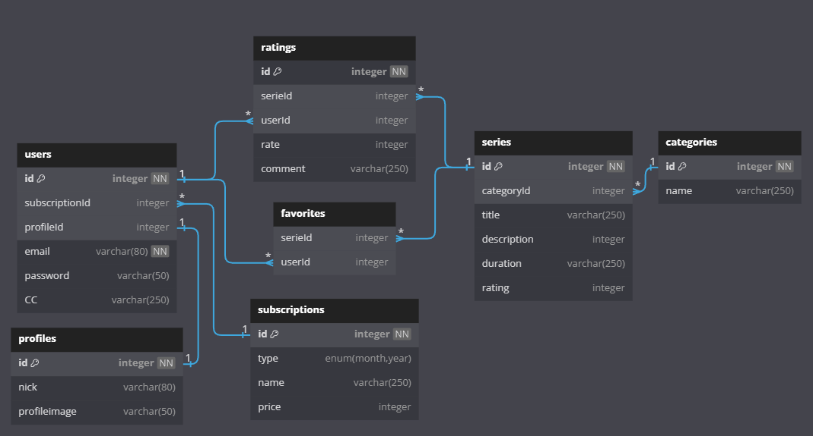
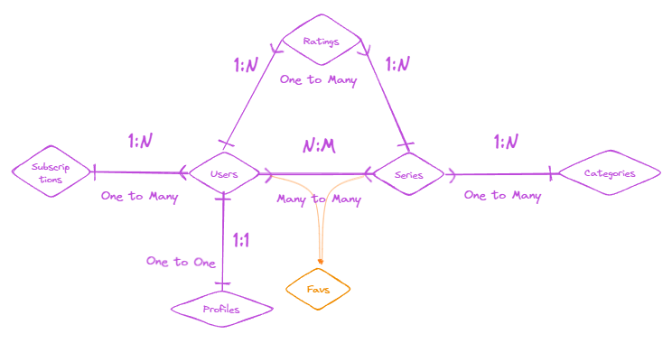

## Routes
- **/auth**
- **/user**
- **/profile**
- **/subscription**
- **/serie**
- **/favorite**
- **/category**
- **/rating**


## Models & CRUD endpoints
Below each model is equivalent to a Database's table with its fields and data parameters.

<details><summary><b>User</b></summary>

- **id** ( type: <em>INTEGER</em>, primaryKey: <em>true</em>, autoIncrement: <em>true</em>, allowNull: <em>true</em> )
- **subscriptionId** (type: <em>INTEGER</em>, foreignKey: <em>true</em>, allowNull: <em>false</em>)
- **profileId** (type: <em>INTEGER</em>, foreignKey: <em>true</em>, allowNull: <em>false</em>)
- **email** (type: <em>INTEGER</em>, allowNull: <em>false</em>, unique: <em>true</em>, validate: <em>isEmail</em>)
- **password** (type: <em>STRING</em>, allowNull: <em>false</em>, validate: regex (<em>Minimum four characters, at least one uppercase letter, one lowercase letter and one number</em>))
- **role** (type: <em>ENUM</em>('user', 'admin'), allowNull: <em>false</em>)

#### Auth
```js
ROUTE /auth

POST: '/signup' => signUp
POST: '/login'  => logIn
```
#### CRUD
```js
ROUTE /user

GET:    '/:userId'  => checkAuth, isAdmin, getUser
GET:    '/'         => checkAuth, getMyUser
PATCH:  '/'  => checkAuth, updateUser
DELETE: '/:userId'  => checkAuth, deleteUser
```
##### DO

➡️ User can signup

➡️ User can login

➡️ User can see their own info

➡️ User can modify their own info

➡️ User can delete theirself


</details>


<details><summary><b>Subscription</b></summary>

- **id** (type: <em>INTEGER</em>, primaryKey: <em>true</em>, autoIncrement: <em>true</em>, allowNull: <em>true</em>)
- **type** (type: <em>ENUM('month', 'year')</em>, allowNull: <em>false</em>)
- **name** (type: <em>VARCHAR</em>, allowNull: <em>false</em>)

#### CRUD
```js
ROUTE /subscription

GET:    '/'         => getAllSubscriptions
POST:   '/:userId'  => checkAuth, subscribe
DELETE: '/:userId'  => checkAuth, unSubscribe
```

#### DO

➡️ User can subscribe

➡️ User can unsubscribe

</details>


<details><summary><b>Profile</b></summary>

- **id** (type: <em>INTEGER</em>, primaryKey: <em>true</em>, autoIncrement: <em>true</em>, allowNull: <em>true</em>)
- **nick** (type: <em>VARCHAR</em>, allowNull: <em>false</em>, unique: <em>true</em>)
- **profileimage** (type: <em>VARCHAR</em>, allowNull: <em>true</em>)

#### CRUD
```js
ROUTE /profile

GET:    '/:userId'  => checkAuth, getProfile
POST:   '/:userId'     => checkAuth, createProfile
PATCH:  '/:profileId'  => checkAuth, updateProfile
DELETE: '/:profileId'  => checkAuth, deleteProfile
```
##### DO

➡️ User can see their own profile

➡️ User can create their own profile

➡️ User can modify their own profile

</details>

<details><summary><b>Category</b></summary>

- **id** (type: <em>INTEGER</em>, primaryKey: <em>true</em>, autoIncrement: <em>true</em>, allowNull: <em>true</em>)
- **name** (type: <em>VARCHAR</em>, allowNull: <em>false</em>)


#### CRUD
```js
ROUTE /category

GET:    '/'            => checkAuth, getAllCategories
GET:    '/:categoryId' => checkAuth, getOneCategory
POST:   '/'            => checkAuth, createCategory
DELETE: '/:categoryId' => checkAuth, deleteCategory
```

</details>

<details><summary><b>Series</b></summary>

- **id** (type: <em>INTEGER</em>, primaryKey: <em>true</em>, autoIncrement: <em>true</em>, allowNull: <em>true</em>)
- **categoryId** (type: <em>INTEGER</em>, foreignKey: <em>true</em>, allowNull: <em>false</em>)
- **title** (type: <em>VARCHAR</em>, allowNull: <em>false</em>, unique: <em>true</em>)
- **description** (type: <em>TEXT</em>, allowNull: <em>true</em>)
- **duration** (type: <em>VARCHAR</em>, allowNull: <em>false</em>)
- **rating** (type: <em>INTEGER</em>, allowNull: <em>true</em>)


#### CRUD
```js
ROUTE /serie

GET:    '/:serieId'               => checkAuth, getOneSerie
GET:    '/'                       => checkAuth, getAllSeries
GET:    '/categoryId/:categoryId' => checkAuth, getSeriesByCategory
POST:   '/'                       => checkAuth, isAdmin, createSerie
PATCH:  '/:serieId'               => checkAuth, updateSerie
```

#### DO

➡️ User can see all series

➡️ User can see one serie

➡️ User can create one serie

➡️ User can update one serie

</details>

<details><summary><b>Favorite</b></summary>

- **serieId** (type: <em>INTEGER</em>, foreignKey: <em>true</em>, allowNull: <em>false</em>)
- **userId** (type: <em>INTEGER</em>, foreignKey: <em>true</em>, allowNull: <em>false</em>)


#### CRUD
```js
ROUTE /favorite

GET:    '/:userId'                => checkAuth, getFavorites
POST:   '/:userId/serie/:serieId' => checkAuth, addFavorite
DELETE: '/:userId/serie/:serieId' => checkAuth, deleteFavorite
```

#### DO

➡️ User can see all their favs series

➡️ User can add one serie to favs

</details>


<details><summary><b>Rating</b></summary>

- **id** (type: <em>INTEGER</em>, primaryKey: <em>true</em>, autoIncrement: <em>true</em>, allowNull: <em>true</em>)
- **serieId** (type: <em>INTEGER</em>, foreignKey: <em>true</em>, allowNull: <em>false</em>)
- **userId** (type: <em>INTEGER</em>, foreignKey: <em>true</em>, allowNull: <em>false</em>)
- **rate** (type: <em>INTEGER</em>, allowNull: <em>false</em>)
- **comment** (type: <em>VARCHAR</em>, allowNull: <em>true</em>)


#### CRUD
```js
ROUTE /rating

GET:    '/:serieId'  => checkAuth, getRating
POST:   '/:serieId'  => checkAuth, createRating
PATCH:  '/:ratingId' => checkAuth, updateRating
DELETE: '/:ratingId' => checkAuth, deleteRating
```

#### DO

➡️ User can create a serie's rating

➡️ User can get one rating

➡️ User can update rating

➡️ User can delete rating


</details>

